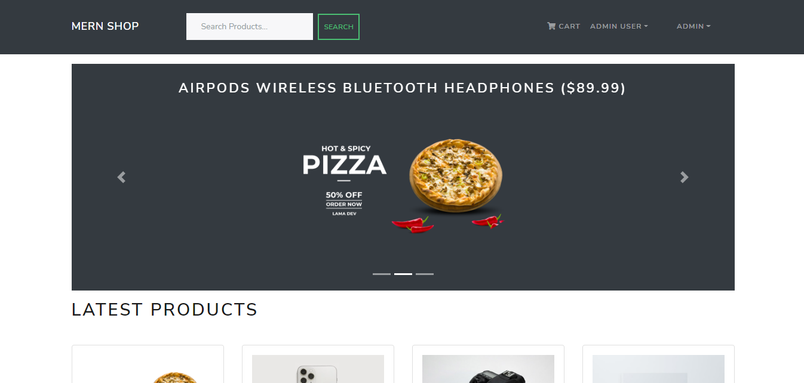

# Mern Shop Ecommerce  FullStack  Website 

## About The Project

[Demo URL](https://mern-ecommerce22.herokuapp.com/)

### Built With

- [react-bootstrap](https://react-bootstrap.github.io/)
- [paypal](https://developer.paypal.com/)
- [React.js](https://reactjs.org/)
- [redux](https://redux.js.org/)
- [react-router-bootstrap](https://www.npmjs.com/package/react-router-bootstrap)
- [react-router-dom](https://reactrouter.com/)
- [express](https://expressjs.com/)
- [mongoose](https://mongoosejs.com/)
- [multer](https://www.npmjs.com/package/multer)
- [jsonwebtoken](https://www.npmjs.com/package/jsonwebtoken)

## Features

- Full featured shopping cart
- Product reviews and ratings
- Top products carousel
- Product pagination
- Product search feature
- User profile with orders
- Admin product management
- Admin user management
- Admin Order details page
- Mark orders as delivered option
- Checkout process (shipping, payment method, etc)
- PayPal / credit card integration
- Database seeder (products & users)

Thanks to [ILW Yennefer](https://www.youtube.com/channel/UC5XDHSUoBC11Kj-iIpx7QkA) 🙏

